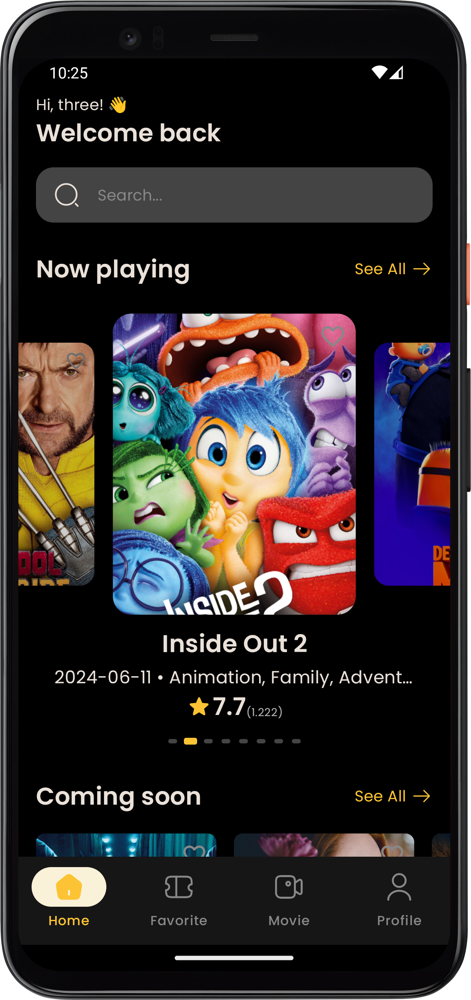
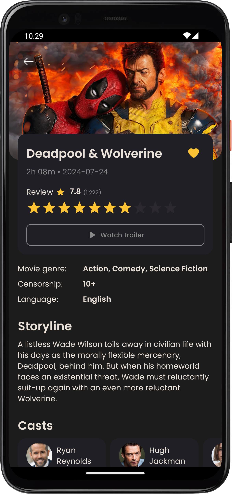
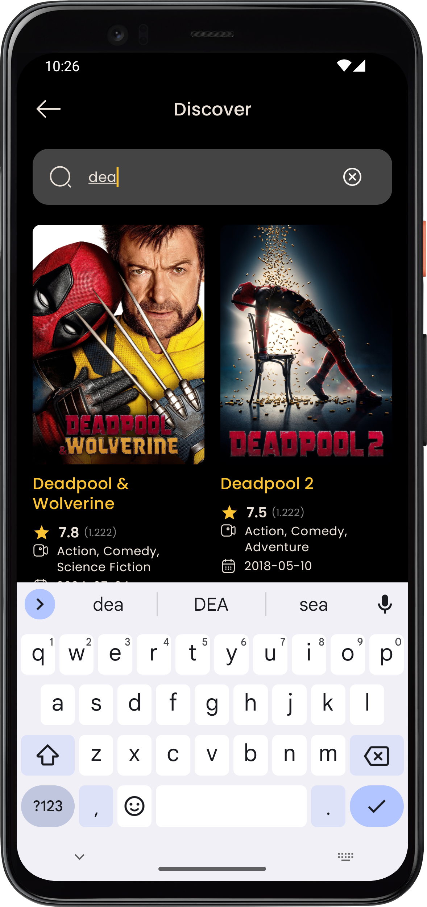
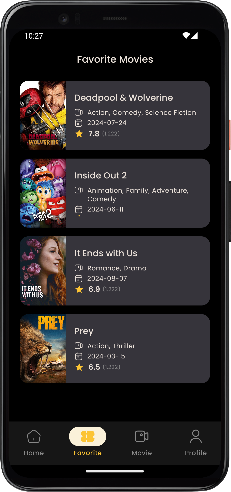
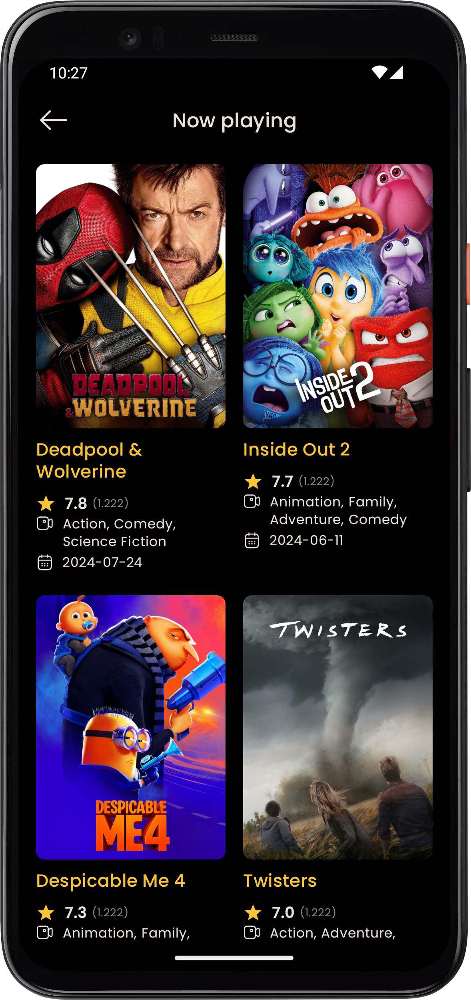
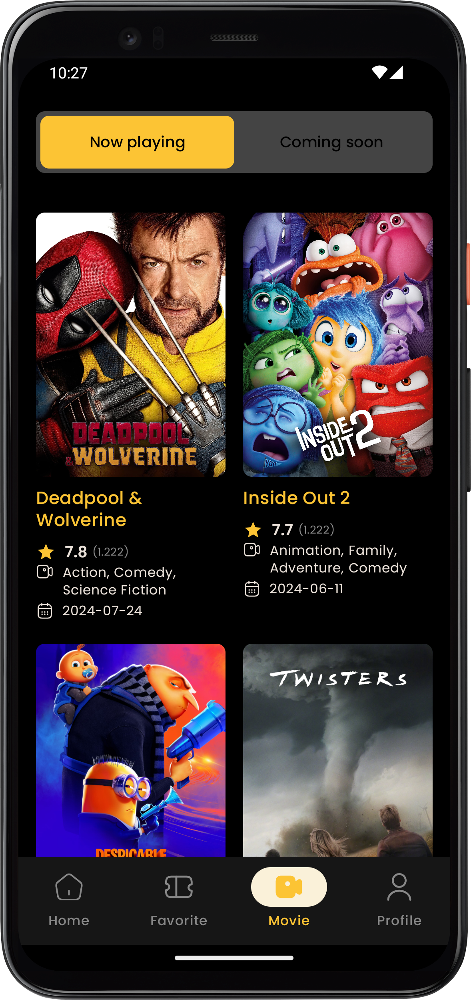
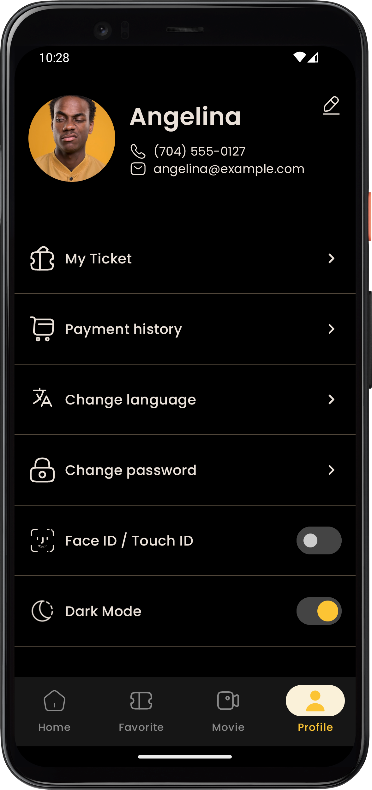

# Compose Movie App

ComposeMovieApp is the one that I developed with Jetpack Compose and Clean Architecture with multi-modules approach. You can find out some latest techs of Android development in here.

## Tech stacks

- Kotlin 2.0.0
- Jetpack Compose
    - Compiler 2.0.0
    - Strong skipping enabled
- KSP (Kotlin Symbol Processing)
- Dagger-Hilt

## Libraries and third parties
- Accompanist-permissions
- SplashScreen API
- Preference DataStore
- Room Database
- Realm 
- Coil 
- Timber

## Features Screenshots

<table>
  <tr>
    <td style="padding: 20px">  </td>
    <td style="padding: 20px">  </td>
    <td style="padding: 20px">  </td>
  </tr>
  <tr>
   <td style="padding: 20px">  </td>
    <td style="padding: 20px">  </td>
    <td style="padding: 20px">  </td>
  </tr>
   <tr>
   <td style="padding: 20px">  </td>
    <td style="padding: 20px">  </td>
  </tr>
</table>

